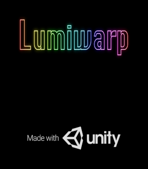
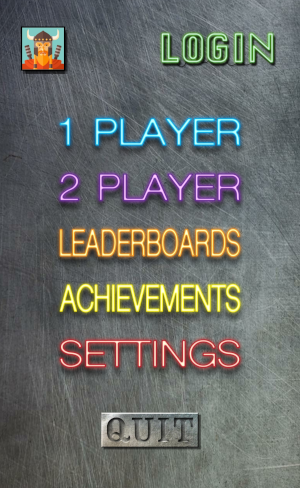
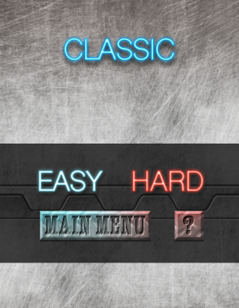
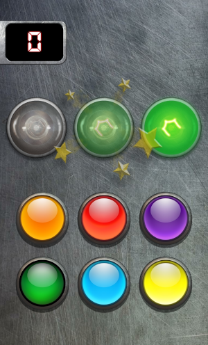
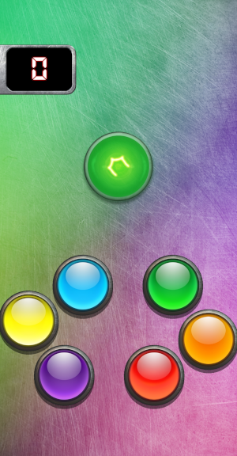
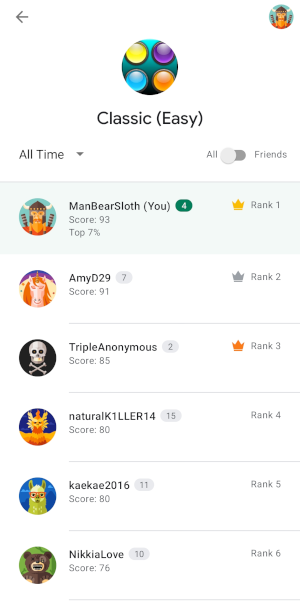
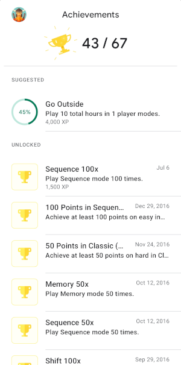

# Lumiwarp
Lumiwarp is a game published to Google Play that I made that was inspired by a childhood toy I had called Brain Warp. But in my game, instead of have a physical ball that you have to turn the right colored side up, you just have to mash the right button that corresponds to the light shown. Sadly, I parted ways with the artist and the project was abandoned. Google took the game off of the store and it doesn't install properly without it live on their servers. I only have this code left and the only working version of the app installed on my phone.

 

There are various modes of 1 to 2 players with alternate difficulties that change up the gameplay for a fresh experience.

 

Some game types change the amount of lights, some move the buttons on you, and with 2-player modes, the first to hit the button wins the point.

   

There are even leaderboards and achievements that use Google Play's integrated systems.

 

